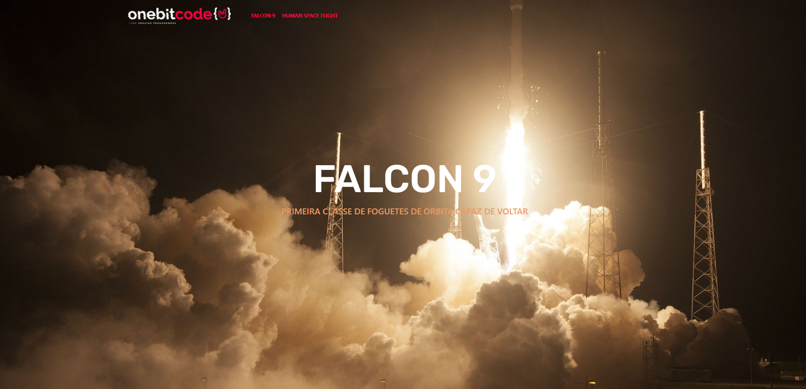
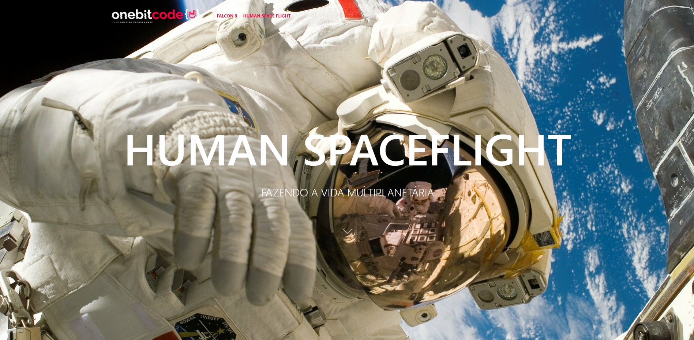

# SpaceX (Clone Page)
Page build using
[HTML](https://developer.mozilla.org/pt-BR/docs/Web/HTML)
, [Sass](https://sass-lang.com/)
, [Bootstrap](https://getbootstrap.com/)
, and [AOS lib](https://michalsnik.github.io/aos/).

`The page uses animations and responsiveness.`

Deployed on
[Heroku](https://heroku.com).
#
## Click [here](https://js-note-client.herokuapp.com/) to see a demo
HOME                            |  Falcon 9                      | Human Spaceflight         
:-------------------------------:|:-----------------------------:|:-------------------------:|
        |        |   |


## Run locally

```bash
git clone https://github.com/eduardovsousa/Clone-SpaceX
Open the project in VS Code
Use the LiveServer extension
```


## Learn how to do 

<p align="center">
<a href="https://go.hotmart.com/P66380356P">

</a>
</p>


###### **Portuguese language
